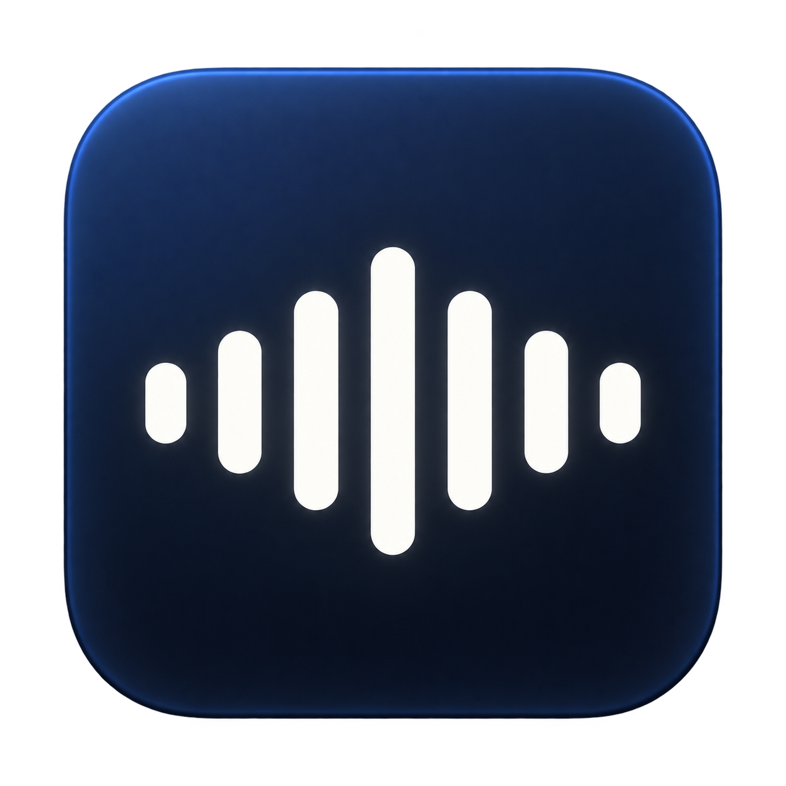

# Dikta



Lokal diktasjon fra menyfeltet. Snakk, stopp, og få teksten limt inn der du jobber.

## Installer

Krever **Apple Silicon og macOS 26+**. Ingen Xcode eller Homebrew.

```sh
curl -fsSL https://github.com/franzwilhelm/dikta/releases/latest/download/install.sh | bash
```

Appen åpnes automatisk. Whisper-modellene lastes ned separat første gang, ca. **1,53 GB**.
Gi mikrofontilgang og aktiver **Tilgjengelighet** for automatisk innliming og Escape.
Appen er ikke notarisert ennå; macOS kan kreve «Åpne likevel» under Personvern og sikkerhet.

For å oppdatere: avslutt Dikta og kjør samme kommando igjen.

## Bruk

- **Start/stopp:** Ctrl + Option + mellomrom.
- **Avbryt:** Escape eller × på panelet.
- **Innstillinger:** Velg NB-Whisper (Medium/Large) eller Mac-diktasjon, norsk eller engelsk, og automatisk innliming eller bare kopiering.
- **Kopier igjen:** «Kopier siste tekst» i menyen.

Tale behandles lokalt. Ingen opptakshistorikk lagres. Transkripsjonen kan inneholde feil eller utelatelser.

[Tekniske detaljer](docs/TECHNICAL.md) · [Bygg og utgivelser](RELEASING.md)
